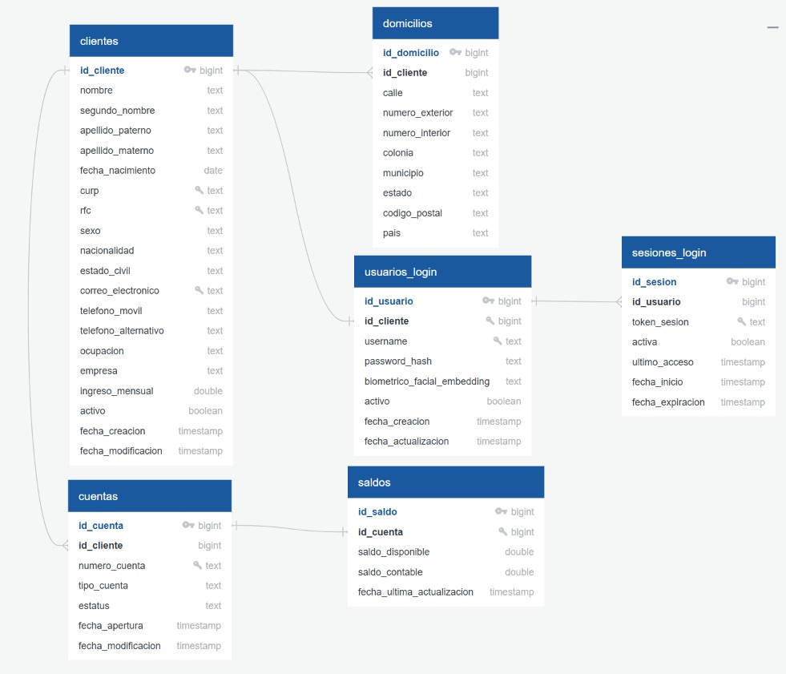

# Proyecto Integrador: Onboarding de Clientes Personas Físicas

## 1. Documento Técnico Oficial
> 📄 **Enlace al Documento Técnico:**  
> [Documento Técnico](https://drive.google.com/file/d/1Amqv0GMp_M2kMNHbXpml_NQJIPlfUq8K/view?usp=sharing)

---

## 2. Instrucciones de Ejecución

### Comandos de Ejecución (Terminal / PowerShell)

1. **Compilar el proyecto:**
   ```powershell
   ./gradlew compileJava
   ```

2. **Ejecutar la aplicación Spring Boot:**
   ```powershell
   ./gradlew bootRun
   ```

3. **Ejecutar pruebas unitarias:**
   ```powershell
   ./gradlew test
   ```

4. **Construir el artefacto ejecutable (JAR):**
   ```powershell
   ./gradlew build -x test
   ```

5. **Documentación Swagger / OpenAPI:**
   Accede a la interfaz interactiva para probar los endpoints en:  
   👉 **`http://localhost:8080/swagger-ui/index.html`**

---

## 3. Diagrama Entidad-Relación (ER)

El archivo del diagrama se encuentra en:
📁 **`resources/diagrama.png`**



---

## 4. Catálogo de Endpoints REST

| Método | Endpoint | Descripción |
| :--- | :--- | :--- |
| **POST** | `/clientes` | Onboarding de cliente (cliente + cuenta + saldo + usuario login). |
| **GET** | `/clientes` | Listar todos los clientes. |
| **GET** | `/clientes/{id}` | Consultar cliente por ID. |
| **GET** | `/clientes/activos` | Consultar clientes activos. |
| **GET** | `/clientes/buscar/curp/{curp}` | Buscar cliente por CURP. |
| **GET** | `/clientes/buscar/rfc/{rfc}` | Buscar cliente por RFC. |
| **GET** | `/clientes/buscar/correo/{correo}` | Buscar cliente por correo electrónico. |
| **GET** | `/clientes/buscar/cuenta/{numeroCuenta}` | Buscar cliente por número de cuenta bancaria. |
| **GET** | `/clientes/fechas?inicio=...&fin=...` | Consultar clientes en un rango de fechas. |
| **PUT** | `/clientes/{id}` | Actualización completa (protege CURP y RFC). |
| **PATCH**| `/clientes/{id}` | Actualización parcial (PATCH) de contacto, domicilio o empleo. |
| **DELETE**| `/clientes/{id}` | Baja lógica del cliente (desactiva cuentas asociadas). |
| **PATCH**| `/clientes/{id}/reactivar` | Reactivación lógica del cliente y sus cuentas. |
| **GET** | `/cuentas/{numeroCuenta}` | Consultar cuenta por número único. |
| **GET** | `/cuentas/activas` | Consultar todas las cuentas bancarias activas. |
| **GET** | `/catalogos/nacionalidades` | Consultar catálogo de nacionalidades desde la BD. |
| **GET** | `/catalogos/nacionalidades/{id}` | Consultar nacionalidad específica por ID. |
| **POST** | `/auth/login` | Iniciar sesión (password cifrado o biometría MediaPipe). |
| **GET** | `/auth/validar-sesion` | Validar sesión activa (contador de 5 min). |
| **POST** | `/auth/logout` | Cierre voluntario de sesión. |

---

## 5. Pruebas Rápidas con cURL (Listas para Terminal / Postman)

### A. Consultar Catálogo de Nacionalidades (Base de Datos)
```bash
curl -X GET "http://localhost:8080/catalogos/nacionalidades"
```

### B. Registro de Cliente (Onboarding)
```bash
curl -X POST "http://localhost:8080/clientes" \
  -H "Content-Type: application/json" \
  -d '{
    "nombre": "Juan",
    "segundoNombre": "Carlos",
    "apellidoPaterno": "Perez",
    "apellidoMaterno": "Lopez",
    "fechaNacimiento": "1992-05-20",
    "curp": "PELJ920520HDFRRN09",
    "rfc": "PELJ9205201A0",
    "sexo": "Masculino",
    "idNacionalidad": 1,
    "nacionalidad": "Mexicana",
    "estadoCivil": "Soltero",
    "correoElectronico": "juan.perez@example.com",
    "telefonoMovil": "5512345678",
    "telefonoAlternativo": "5587654321",
    "domicilio": {
      "calle": "Av. Insurgentes Sur",
      "numeroExterior": "1602",
      "numeroInterior": "Piso 4",
      "colonia": "Credito Constructor",
      "municipio": "Benito Juarez",
      "estado": "Ciudad de Mexico",
      "codigoPostal": "03940",
      "pais": "Mexico"
    },
    "ocupacion": "Ingeniero de Software",
    "empresa": "Tech Solutions",
    "ingresoMensual": 45000.00,
    "saldoInicial": 2500.00,
    "password": "PasswordSeguro123*",
    "biometricoFacialEmbedding": "[0.12, -0.45, 0.89, -0.05, 0.67]"
  }'
```

### C. Actualización Parcial (PATCH)
```bash
curl -X PATCH "http://localhost:8080/clientes/1" \
  -H "Content-Type: application/json" \
  -d '{
    "telefonoMovil": "5599887766",
    "ingresoMensual": 55000.00,
    "ocupacion": "Lead Architect"
  }'
```

### C. Consultar Saldo de Cuenta
```bash
curl -X GET "http://localhost:8080/cuentas/1000000001/saldo" \
  -H "Accept: application/json"
```

### D. Login con Contraseña (Inicia Sesión de 5 min)
```bash
curl -X POST "http://localhost:8080/auth/login" \
  -H "Content-Type: application/json" \
  -d '{
    "username": "juan.perez@example.com",
    "password": "PasswordSeguro123*"
  }'
```

### E. Login con Biometría Facial (MediaPipe)
```bash
curl -X POST "http://localhost:8080/auth/login" \
  -H "Content-Type: application/json" \
  -d '{
    "username": "juan.perez@example.com",
    "biometricoFacialEmbedding": "[0.12, -0.45, 0.89, -0.05, 0.67]"
  }'
```

### F. Validar Sesión Activa (Verifica y renueva timeout de 5 min)
```bash
curl -X GET "http://localhost:8080/auth/validar-sesion" \
  -H "Authorization: Bearer <TOKEN_DE_SESION>"
```

### G. Baja Lógica (DELETE)
```bash
curl -X DELETE "http://localhost:8080/clientes/1"
```
